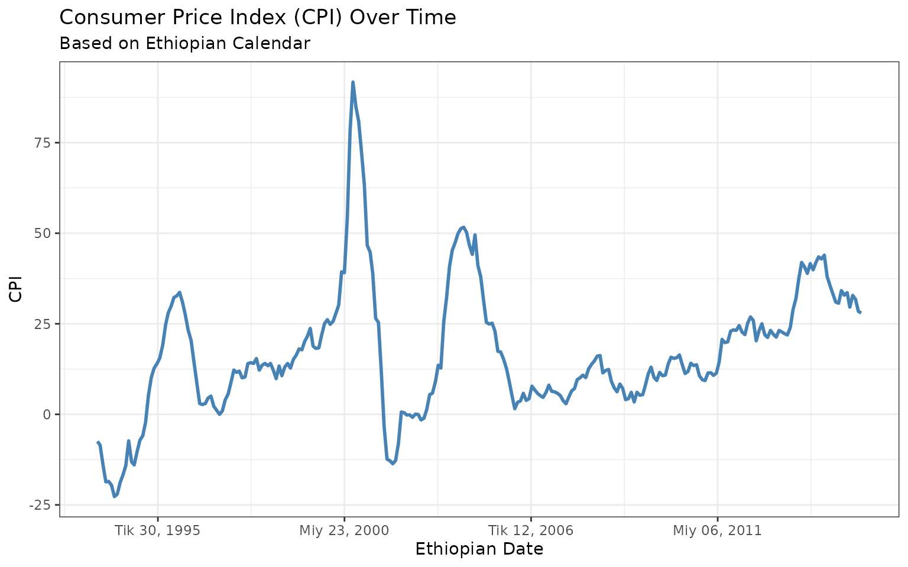
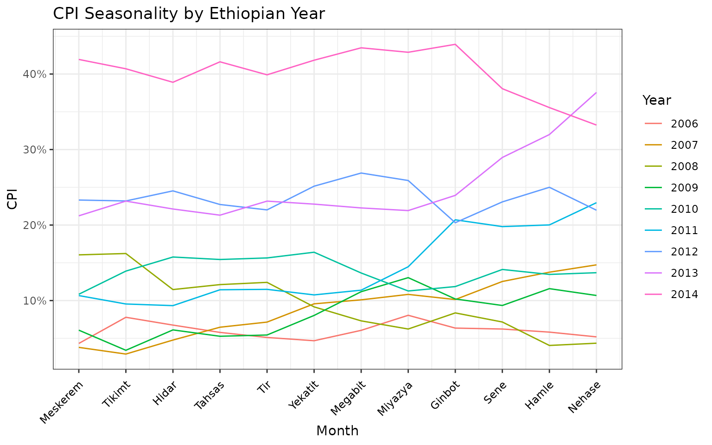
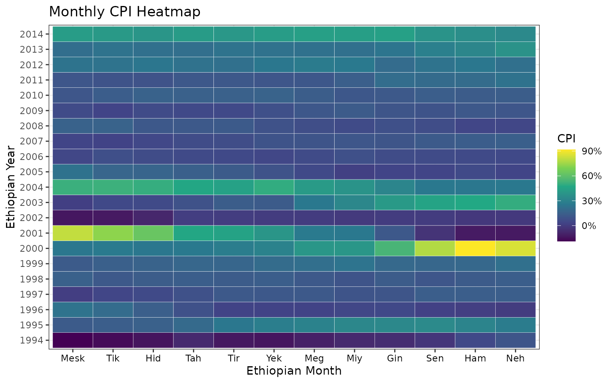

# ethiodate and ggplot2

## Introduction

The ethiodate package provides a modern infrastructure for working with
Ethiopian calendar dates in R. One of its powerful features is the
ability to use `ethdate` objects seamlessly within the
[ggplot2](https://ggplot2.tidyverse.org) ecosystem for data
visualization.

This vignette walks through advanced use of ethiodate with ggplot2,
using the built-in `cpieth` dataset, which includes monthly Consumer
Price Index (CPI) data from 2001 onward.

## Data

``` r
library(ethiodate)
library(ggplot2)
library(dplyr)
head(cpieth)
#> # A tibble: 6 × 2
#>   date          cpi
#>   <date>      <dbl>
#> 1 2001-01-31  -7.46
#> 2 2001-02-28  -8.54
#> 3 2001-03-31 -14.0 
#> 4 2001-04-30 -18.6 
#> 5 2001-05-31 -18.5 
#> 6 2001-06-30 -19.6
```

The `cpieth` dataset contains:

- date: Gregorian Date object
- cpi: Numeric consumer price index

Let’s convert date to `ethdate`. In addition, extract different
components of the date like year, month, and quarter

``` r
cpieth <- cpieth |>
  mutate(edate = eth_date(date),
         eyear = eth_year(edate),
         emonth = eth_month(edate),
         equarter = eth_quarter(edate))
```

## Basic CPI Time Series Plot

Let’s visualize the CPI trend overtime.

``` r
p <- ggplot(cpieth, aes(x = edate, y = cpi)) +
  geom_line(color = "steelblue", linewidth = 1) +
  labs(title = "Consumer Price Index (CPI) Over Time",
       subtitle = "Based on Ethiopian Calendar",
       x = "Ethiopian Date", y = "CPI") +
  theme_bw()

p
```



What makes this plot powerful is that we’re using the`ethdate` object
directly on the x-axis. There’s no need to manually convert or relabel —
it just works.

But wait — we can do better.

Here’s what we’re doing:

- Using
  [`scale_x_ethdate()`](https://guturago.github.io/ethiodate/reference/ethdate-ggplot.md)
  to customize year-based ticks
- Applying `eth_labels("%Y")` to format labels in Ethiopian years
- Formatting CPI values as percentages for intuitive understanding
- Adding a zero baseline with
  [`geom_hline()`](https://ggplot2.tidyverse.org/reference/geom_abline.html)
  for visual reference

``` r
p + 
  scale_x_ethdate(breaks = eth_breaks(7),
                  labels = eth_labels("%Y")) + 
  scale_y_continuous(labels = scales::label_percent(scale = 1)) + 
  geom_hline(yintercept = 0, linewidth = 0.3, linetype = 2, color = "tomato")
```


This gives you a clean, elegant time series plot that speaks directly to
Ethiopian policymakers and economists.

## CPI Seasonality by Month and Year

Now, let’s understand seasonal CPI patterns across Ethiopian years:

``` r
p1 <- cpieth |> 
  filter(eyear > 2005 & eyear < 2015) |> 
  ggplot(aes(x = emonth, y = cpi, group = eyear, color = factor(eyear))) +
  geom_line() +
  scale_x_continuous(breaks = 1:13, labels = eth_show(lang = "lat")) +
  scale_y_continuous(labels = scales::label_percent(scale = 1)) +
  labs(title = "CPI Seasonality by Ethiopian Year",
       x = "Month", y = "CPI", color = "Year") +
  theme_bw() + 
  theme(axis.text.x = element_text(angle = 45, vjust = 0.9, hjust = 1, colour = "black"))

p1
```



What we see here is how CPI values shift month-to-month, year-by-year —
with full support for the Ethiopian year. And by adding Amharic month
labels with `eth_show(lang = "amh")`, we speak the language of our
audience — literally.

## Monthly CPI Heatmap

Heatmaps provide a quick visual summary of monthly price patterns:

``` r
p2 <- cpieth |> 
  filter(eyear > 1993 & eyear < 2015) |> 
  ggplot(aes(x = factor(emonth), y = factor(eyear), fill = cpi)) +
  geom_tile(color = "white") +
  scale_fill_viridis_c(labels = scales::label_percent(scale = 1)) +
  scale_x_discrete(labels = eth_show("%b", "lat")) +
  labs(title = "Monthly CPI Heatmap",
       x = "Ethiopian Month", y = "Ethiopian Year", fill = "CPI") +
  theme_bw() + 
  theme(axis.text.x = element_text(colour = "black"))

p2
```



Heatmaps are excellent for revealing spikes, drops, and anomalies. In
just one frame, you can identify patterns like seasonal inflation or
economic shocks. The Ethiopian months are elegantly handled, and the
color legend is formatted as a percentage using
[`scales::label_percent()`](https://scales.r-lib.org/reference/label_percent.html)
— no extra work needed.

## Aggregated CPI by Quarter

This aggregation allows us to zoom out — highlighting macroeconomic
trends, policy shifts, or external shocks that affect quarterly
inflation. Again, we’re using
[`eth_quarter()`](https://guturago.github.io/ethiodate/reference/eth_year.md)
straight from ethiodate — no need for hardcoded date logic.

``` r
cpieth |>
  filter(eyear > 2010) |> 
  mutate(equarter = eth_quarter(edate)) |> 
  group_by(eyear, equarter) |>
  summarise(mean_cpi = mean(cpi), .groups = "drop") |> 
  ggplot(aes(x = interaction(eyear, equarter), y = mean_cpi)) +
  geom_col(fill = "darkorange") +
  labs(title = "Quarterly Average CPI after 2010",
       x = "Ethiopian Quarter", y = "Average CPI") +
  theme_bw() +
  theme(axis.text.x = element_text(angle = 45, vjust = 1, hjust=1))
```


## Summary

The ethiodate package makes it simple and intuitive to visualize time
series data using the Ethiopian calendar system. Key features include:

- `ethdate` class integration with ggplot2
- Built-in scale functions like
  [`scale_x_ethdate()`](https://guturago.github.io/ethiodate/reference/ethdate-ggplot.md),
  [`scale_y_ethdate()`](https://guturago.github.io/ethiodate/reference/ethdate-ggplot.md),
  [`eth_breaks()`](https://guturago.github.io/ethiodate/reference/ethdate-ggplot.md),
  and
  [`eth_labels()`](https://guturago.github.io/ethiodate/reference/ethdate-ggplot.md).
- Accessor functions:
  [`eth_year()`](https://guturago.github.io/ethiodate/reference/eth_year.md),
  [`eth_month()`](https://guturago.github.io/ethiodate/reference/eth_year.md),
  [`eth_quarter()`](https://guturago.github.io/ethiodate/reference/eth_year.md),
  `eth_week()`
- Built-in dataset `cpieth` for ready-to-use exploration

These features make ethiodate an ideal tool for researchers and
policymakers working in Ethiopia.
